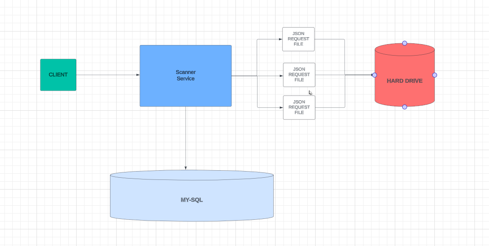

SCANNER APPLICATION
-----------------------------------------------------------------------------------------------------------

## Prerequisites:
- Docker
- Docker Compose (if using)

-----------------------------------------------------------------------------------------------------------
## Instructions

1. Download the Postman collection from the "resources" package.

-----------------------------------------------------------------------------------------------------------

## Running the MySQL Database Container

1. Open a terminal in the root directory of the project.
2. Run the following command to start the MySQL container:
   ```bash
   docker-compose up -d


-----------------------------------------------------------------------------------------------------------

# Backend Architecture



-----------------------------------------------------------------------------------------------------------
